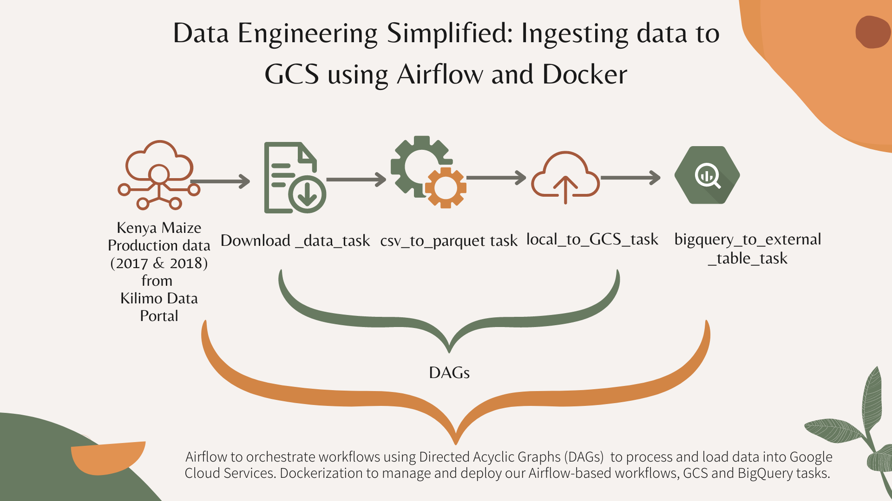
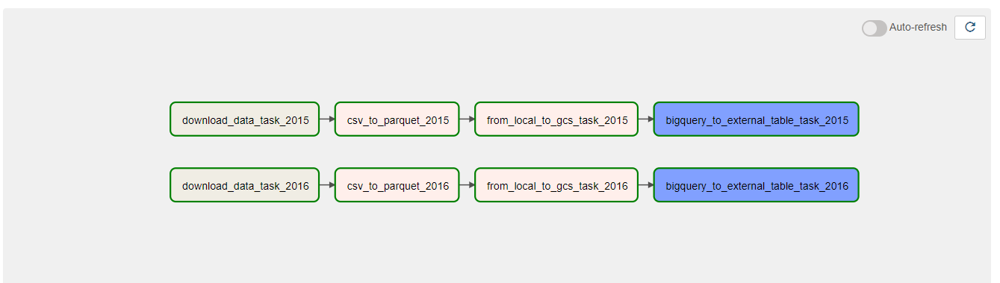
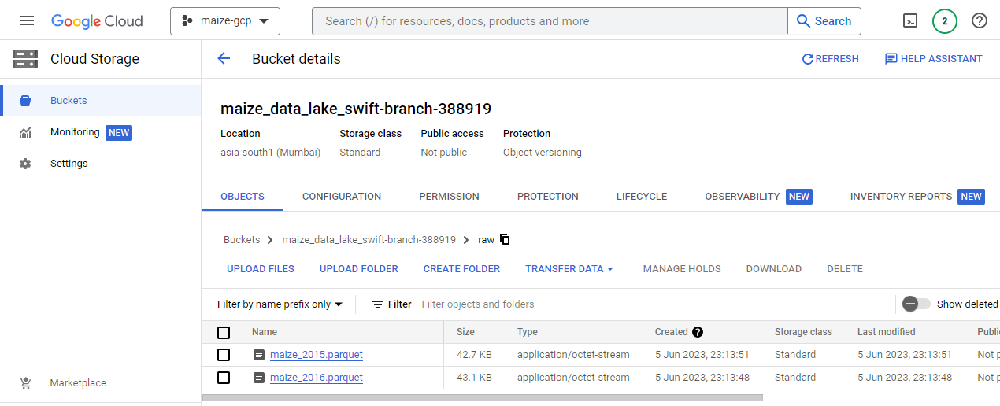
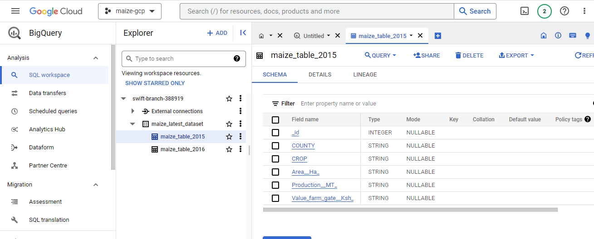

# Ingesting data to GCP with Airflow (docker)

This project is a continuation of the [Simple ETL Data Pipeline](https://github.com/katenjoki/simple_data_pipeline) where we built an ETL pipeline designed to run on Docker containers. The pipeline **extracts** Kenya's 2017 and 2018 Maize Production data by Counties from the [Kilimo Data Portal](http://kilimodata.org/dataset/kenya-maize-production-by-counties), **transforms** and **loads** the data into a PostgresQL database and uses pgAdmin to visualize, manage and interact with pgAdmin.

If you're interested, check out this repo where I [ingested data into local PostgreSQL using airflow and docker](https://github.com/katenjoki/postgresql_airflow/tree/master) using the same data.

# Table of contents

- [Table of Contents](#Table-Of-Contents)
- [Project Summary](#project-summary)
- [Prerequisites](#prerequisites)
- [Installation and Setup](#installation-and-setup)
- [Running Airflow](#running-airflow)

# Project Summary
 

In this project, I used Airflow as an orchestrator for data processing tasks. I defined and executed the workflows using Directed Acyclic Graphs (DAGS) to represent the sequence of tasks needed to process and load data into Google Cloud Storage and subsequently, BigQuery.
To do this project, you have to setup your google cloud account. You can find steps and reference videos on how to do this in the [Terraform READme](GCP_Terraform/terraform/README.md).

# Prerequisites
* Docker: Make sure you have Docker installed on your machine. You can download and install Docker from the official website: https://www.docker.com
    You may need to set the memory for your Docker Engine to a minimum of 5GB otherwise if enough memory is not allocated, it might lead to airflow-webserver continuously restarting.
* Google Cloud Account
* Terraform installation

# Installation and Setup
1. Git clone the repo.
```
git clone https://github.com/katenjoki/airflow_gcp.git
```
2. Rename your gcp-service-accounts-credentials file to google_maize_credentials.json & store it in your $HOME directory. 
If you choose to rename it as something else e.g 'google_credentials.json', make sure this reflects on the docker-compose.yaml file as well, otherwise it won't run.
```
cd ~ && mkdir -p ~/.google/credentials/
mv <path/to/your/service-account-authkeys>.json ~/.google/credentials/google_maize_credentials.json
```
3. Open the .env file and review/update the following environment variables: <br>
* To set/change the value of the AIRFLOW_UID variable to your user's UID (User ID) run the following command. For Windows, use MINGW/GitBash and execute the same command.
    ```
    echo -e "AIRFLOW_UID=$(id -u)" > .env
    ```

4. Edit the following in the environment section of the docker_compose.yaml file to reflect your project's details after [setting up your GCS infrastructure with Terraform](GCP_Terraform/terraform/READme.md):

5. Navigate to the airflow folder.
```
cd airflow
```
6. Build the docker container
```
docker-compose build
```
7. Initialise airflow containers
```
docker-compose up airflow-init
```
8. Run the docker container
```
docker-compose up
```

# Running Airflow
Access the Airflow web interface (http://localhost:8080) and sign in with "airflow" as the username and the password. Please note that using these credentials is not recommended for production environments and only for demonstrative purposes.

Trigger the 'ingest_data_gcs_dag' by running the 'play' button on the action tab and monitor the DAG runs.

When the workflow runs successfully, this is what you should see:


Next, go to your Google Cloud console and select 'Cloud Storage' then 'Buckets'.
You should see the 'maize_2017.parquet' and 'maize_2018.parquet' in the 'raw/' folder.


To perform complex data analysis and generate insights, select 'BigQuery' where you should see the loaded datasets as shown below.

